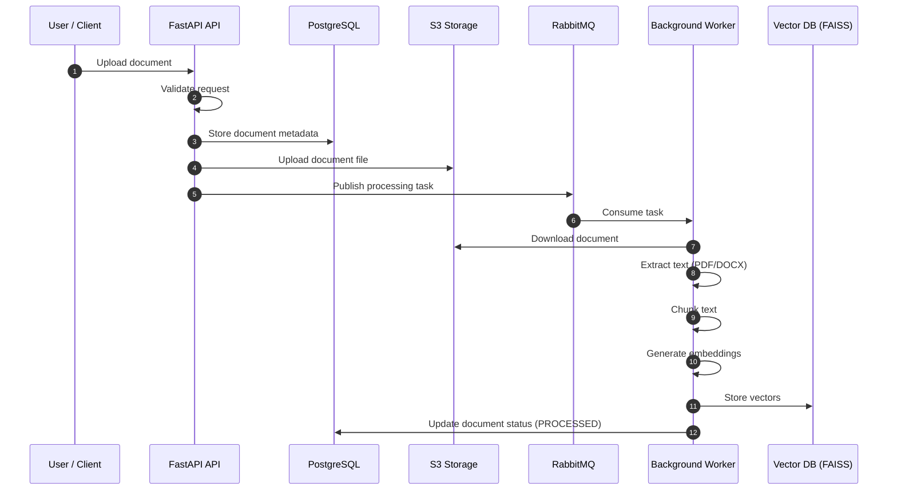
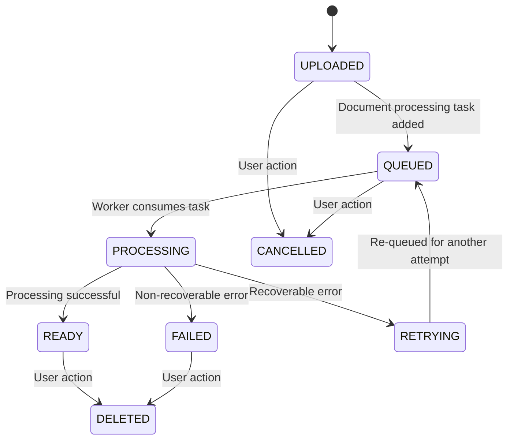

# 📄 DocQuery — RAG-Based Document Query Platform

DocQuery is an **end-to-end backend system** for **document ingestion, asynchronous processing, and Retrieval-Augmented Generation (RAG)**.  
It enables users to upload documents, generate embeddings, and query them using natural language in a scalable, production-inspired architecture.

This project is built as a **learning-focused yet real-world system**, emphasizing clean backend design, distributed processing, and modern AI-backed retrieval techniques.

---

## ✨ Problem Statement

Large Language Models (LLMs) cannot:
- Reliably process large documents
- Access private or user-uploaded data
- Guarantee factual answers without grounding

DocQuery solves this by:
- Chunking documents into smaller units
- Converting text into embeddings
- Retrieving only relevant chunks at query time
- Generating answers grounded in document context using RAG

---

## 🚀 Core Features

- 📥 Document upload with metadata tracking
- ⚙️ Asynchronous document processing using background workers
- ✂️ Text extraction and configurable chunking
- 🧠 Embedding generation pipeline
- 🔍 Semantic search using vector similarity
- 📨 Message-driven architecture using RabbitMQ
- ☁️ Cloud-ready storage using S3-compatible buckets
- 📊 Explicit document lifecycle management

---

## 🏗️ Clean Architecture Overview

                                ┌──────────────┐
                                │    Client    │
                                │  (UI / API)  │
                                └──────┬───────┘
                                       │
                                      HTTP
                                       │
                                       ▼
                            ┌────────────────────────┐
                            │      FastAPI API       │
                            │────────────────────────│
                            │ • Request validation   │
                            │ • Metadata storage     │
                            │ • Upload to S3         │
                            │ • Publish task         │
                            └──────┬─────────┬───────┘
                                   │         │
                                   │         └──────────┐
                                   ▼                    ▼
                            ┌──────────────┐     ┌──────────────┐
                            │ PostgreSQL   │     │   RabbitMQ   │
                            │ (Metadata)   │     │ (Task Queue) │
                            └──────────────┘     └──────┬───────┘
                                                        │
                                                        ▼
                                                ┌──────────────────┐
                                                │ Background Worker│
                                                │──────────────────│
                                                │ • Download file  │
                                                │ • Extract text   │
                                                │ • Chunk text     │
                                                │ • Embed chunks   │
                                                │ • Store vectors  │
                                                └──────┬───────────┘
                                                       │
                                                       ▼
                                                ┌──────────────┐
                                                │  Vector DB   │
                                                │ (FAISS etc.) │
                                                └──────────────┘

### High-Level Flow
1. Client uploads a document
2. FastAPI API validates request and stores metadata
3. File is uploaded to object storage (S3)
4. Task is published to RabbitMQ
5. Background worker processes the document
6. Embeddings are stored in the vector database
7. User queries retrieve relevant chunks for RAG

---

## 🔁 Sequence Diagram — Document Ingestion & Processing


```mermaid
sequenceDiagram

    autonumber

    participant U as User / Client
    participant API as FastAPI API
    participant DB as PostgreSQL
    participant S3 as S3 Storage
    participant MQ as RabbitMQ
    participant W as Background Worker
    participant VDB as Vector DB (FAISS)

    U->>API: Upload document
    API->>API: Validate request
    API->>DB: Store document metadata
    API->>S3: Upload document file
    API->>MQ: Publish processing task

    MQ->>W: Consume task
    W->>S3: Download document
    W->>W: Extract text (PDF/DOCX)
    W->>W: Chunk text
    W->>W: Generate embeddings
    W->>VDB: Store vectors

    W->>DB: Update document status (PROCESSED)
```

---


## 🧠 RAG Processing Flow

                                        User Query
                          __________________│__________________
                          ▼                                   ▼
          Vector Search (semantic recall)         BM25 Search (lexical recall)
                          │                                   │
                          └─────────────────┬─────────────────┘
                                            ▼
                                    Union of candidates
                                            │
                                            ▼
                                    Reranking (judgment)
                                            │
                                            ▼
                                    LLM (Context + Question)
                                            │
                                            ▼
                                        Final Answer


---

## 🛠️ Tech Stack

### Backend
- **Python 3.11**
- **FastAPI**
- **SQLAlchemy**
- **PostgreSQL**

### Async & Messaging
- **RabbitMQ**
- Dedicated background worker service

### Storage
- **AWS S3** (or any S3-compatible storage)

### Vector Search
- **FAISS** (pluggable for other vector databases)

### Infrastructure
- **Docker**
- **Docker Compose**

---

## 📁 Project Structure

```text
docquery/
├── api/
│   ├── alembic/          # Database migrations
│   ├── app/
│   │   ├── constants/    # Constants
│   │   ├── core/         # Core components (settings, middleware)
│   │   ├── db/           # Database repositories and session
│   │   ├── models/       # SQLAlchemy ORM models
│   │   ├── routers/      # API endpoints (v1)
│   │   ├── schemas/      # Pydantic models
│   │   ├── services/     # Business logic
│   │   └── main.py       # FastAPI application entrypoint
│   ├── alembic.ini       # Alembic configuration
│   └── Dockerfile        # FastAPI application Dockerfile
│
├── data/                 # Sample data for testing
├── shared/
│   ├── config/           # Shared logging and settings
│   ├── embeddings/       # AI model and embedding utilities
│   ├── messaging/        # RabbitMQ client and connection
│   ├── storage/          # Cloud storage clients
│   └── utils/            # Common utilities
│
├── worker/
│   ├── app/
│   │   ├── constants/    # Constants
│   │   ├── consumers/    # RabbitMQ message consumers
│   │   ├── core/         # Core components (settings, middleware)
│   │   ├── db/           # Database repositories
│   │   ├── processors/   # Text extraction, chunking, embedding
│   │   ├── services/     # Service logic
│   │   └── main.py       # Worker application entrypoint
│   └── Dockerfile        # Worker Dockerfile
│
├── docker-compose.yml.   # Docker Compose configuration
└── README.md
```

---

## 🔄 Document Lifecycle

The lifecycle of a document is explicitly tracked through a series of statuses, providing clear observability into the ingestion and processing pipeline.


```mermaid
stateDiagram-v2
    [*] --> UPLOADED
    UPLOADED --> QUEUED: Document processing task added
    QUEUED --> PROCESSING: Worker consumes task
    PROCESSING --> READY: Processing successful
    PROCESSING --> FAILED: Non-recoverable error
    PROCESSING --> RETRYING: Recoverable error
    RETRYING --> QUEUED: Re-queued for another attempt

    UPLOADED --> CANCELLED: User action
    QUEUED --> CANCELLED: User action
    READY --> DELETED: User action
    FAILED --> DELETED: User action
```

-   `UPLOADED`: The document has been successfully uploaded and a corresponding record is created. It is awaiting to be queued for processing.
-   `QUEUED`: A processing task for the document has been published to the message queue.
-   `PROCESSING`: A worker is actively processing the document (extracting text, chunking, and generating embeddings).
-   `READY`: The document has been fully processed and its vector embeddings are available for querying.
-   `FAILED`: Processing failed due to a non-recoverable error. Manual intervention may be required.
-   `RETRYING`: Processing failed with a recoverable error. The system will automatically re-queue the task for another attempt.
-   `PARTIAL`: The document was only partially processed due to errors with specific sections. Some content may be available for querying.
-   `CANCELLED`: A user or an automated process cancelled the processing task before completion.
-   `DELETED`: The document and all its associated data have been permanently deleted from the system.

The `document_statuses` table acts as a lookup for document lifecycle states. After the database is running, you can seed it with the necessary statuses by running the following command:

```bash
docker exec -i docquery-postgres psql -U ADD-USER -d ADD-DB <<EOF
INSERT INTO document_statuses (id, name, description) VALUES
  (1, 'UPLOADED',   'Document metadata stored and file uploaded'),
  (2, 'QUEUED',     'Message published to queue, awaiting worker'),
  (3, 'PROCESSING', 'Worker is processing the document'),
  (4, 'RETRYING',   'Processing failed temporarily, retrying'),
  (5, 'PARTIAL',    'Some chunks processed successfully'),
  (6, 'READY',      'Document fully processed and queryable'),
  (7, 'CANCELLED',  'Processing was cancelled by user or system'),
  (8, 'FAILED',     'Processing failed permanently'),
  (9, 'DELETED',    'Document was logically deleted')
ON CONFLICT (id) DO NOTHING;
EOF
```

---

## ⚙️ Local Development Setup

```bash
git clone https://github.com/Tanny1810/DocQuery.git docquery
cd docquery
docker-compose up --build
```

---

## ⚙️ Services Started

- FastAPI API  
- RabbitMQ  
- PostgreSQL  
- Background Worker  

---

## 🧩 Key Design Decisions

- Separate worker service to isolate heavy computation  
- Message queue-based processing for reliability and scalability  
- Chunk-based embeddings to handle large documents efficiently  
- Explicit status tracking for observability  
- Cloud-compatible architecture without vendor lock-in  

---

## 🎯 Learning Objectives

- Build a complete RAG system  
- Design scalable backend architectures  
- Work with message queues and workers  
- Understand vector databases and embeddings  
- Apply clean code and modular design principles  

---

## 🧭 Project Roadmap & Versioned Capabilities

DocQuery is a production-oriented Retrieval-Augmented Generation (RAG) backend designed to evolve from a secure, multi-tenant document QA system into a full document intelligence platform.

This document tracks **what is completed, what is in progress, and what is planned** across versions.

---

## ✅ V1 – Core RAG Foundation (**Completed**)

**Focus:** Reliable ingestion & retrieval pipeline

### Capabilities
- Document upload and ingestion ✅  
- Asynchronous processing using background workers (RabbitMQ) ✅  
- Chunking and embedding generation ✅  
- Vector-based semantic search (FAISS) ✅  
- Retry handling and DLQ for failed jobs ✅  
- Explicit document lifecycle management (QUEUED → READY / FAILED) ✅  

### Status
✔ **Stable and complete**  
V1 establishes a solid event-driven RAG backend with clear document lifecycle guarantees.

---

## 🚀 V2 – Multi-User & Production-Grade RAG (**In Progress**)

**Focus:** Multi-tenancy, API maturity, retrieval quality, and production readiness

---

### 🔐 Authentication & Multi-Tenancy

- JWT-based authentication (REST + GraphQL) ✅  
- User registration and login APIs ✅  
- Mandatory authentication for all APIs ✅  
- Per-user document ownership enforced at DB level ✅  
- Tenant-safe RAG retrieval (no cross-user leakage) ✅  

**Status:** ✔ Completed

---

### 🌐 API Layer Enhancements

- Read-only GraphQL API for queries ✅  
- Secure GraphQL auth context (JWT-based) ✅  
- `document(id)` GraphQL query with ownership checks ✅  
- Cursor-based GraphQL pagination (connection pattern) ✅  
- UsageStats GraphQL query (documents, chunks, queries) ✅

**Status:** ✔ Completed
> REST /query and GraphQL ask now call the same RAG service, with:
>  - shared rate limits
>  - shared audit
>  - shared behavior

---

### 🧠 RAG Architecture & Quality (Single-Mode)

- Naive RAG implementation (vector → prompt → LLM) ✅  
- Explicit “I don’t know” behavior for weak evidence ✅  
- RAG strategy abstraction (pluggable architecture) ✅  
- RAG debug metadata (retrieval & prompt introspection) ✅  
- Lightweight chunk reranking ✅  
- Hybrid retrieval (vector + keyword search) ✅  
- Answer confidence scoring ✅ 

**Planned / In Progress** 
- Richer source attribution (page / chunk metadata) 🔄  

> ⚠️ V2 intentionally supports **one primary RAG mode (fact-lookup)**.  
> Multi-RAG selection is introduced in V3.

---

### 📄 Ingestion & Chunking Improvements

**Planned**
- Improved PDF parsing ⏳  
- DOCX ingestion ⏳  
- PPTX ingestion ⏳  
- TXT / Markdown ingestion ⏳  
- Smarter chunking (semantic + windowed strategies) ⏳

> These intentionally come after RAG quality work.
> There’s no point ingesting more formats until retrieval quality is measurable.

---

### 🗄️ Infrastructure & Performance
- Persistent query audit trail per user ✅
- Rate limiting (quota-based) ✅

**Planned**
- Migration from FAISS to a production-ready vector database (Qdrant / Weaviate / Pinecone) ⏳  
- Internal gRPC communication between API and workers ⏳  
- RAG request timeout handling and error hardening ⏳  

---

### V2 Summary

**Completed**
- Secure multi-user architecture
- JWT auth across REST & GraphQL
- Production-grade GraphQL API
- Cursor pagination
- UsageStats with real accounting
- Query audit ledger
- Rate limiting (quota-based)
- Clean service-layer RAG orchestration
- RAG quality improvements  
- Retrieval robustness and observability
- Debuggability for ranking & prompts

**In Progress**
- Richer source attribution

**Breaking Changes Introduced**
- Authentication is mandatory  
- All queries are user-scoped
- Rate limits enforced per user

---

## 🚀 V3 – Platform, Monetization & Multi-RAG Support (**Planned**)

**Focus:** SaaS readiness, scalable retrieval, and user-selectable RAG modes

---

### 🧠 Multi-RAG Architecture (First-Class Feature)

- User-selectable RAG modes via API / GraphQL  
- Intent-aware RAG routing (fact vs list vs summary)  
- Dedicated prompt templates per RAG mode  
- Mode-specific retrieval strategies  

### Supported RAG Types
- **Fact Lookup RAG** (high-precision, low recall)  
- **Hybrid RAG** (vector + keyword retrieval)  
- **Summary RAG** (high-recall, aggregation-safe)  
- **Document-Scoped RAG** (single document deep dives)  

---

### 💰 Platform & Monetization

- Usage tracking and quotas  
- Plan-based limits (free / paid tiers)  
- API rate limiting and abuse protection  
- API keys and webhook support  
- SDKs for third-party integration  

---

### 📄 Multimodal Ingestion

- Audio document ingestion (speech-to-text)  
- Image-based document ingestion (OCR)  

---

### Infrastructure & Deployment

- Kubernetes-based deployment (EKS or equivalent)  
- Horizontal Pod Autoscaling (API + workers)  
- Health checks, rolling deployments, self-healing  
- Environment-based configuration (Secrets / ConfigMaps)  

---

## 🚀 V4 – Agentic & Adaptive RAG Intelligence (**Future**)

**Focus:** Autonomous reasoning, adaptive retrieval, and document intelligence workflows

---

### 🤖 Advanced Multi-RAG Capabilities

- Agent-driven RAG orchestration  
- Dynamic RAG mode switching per query  
- Multi-pass retrieval and self-refinement  
- Confidence-aware answer verification  
- Cross-document reasoning  

### Planned RAG Types
- **Comparative RAG** (document vs document)  
- **Temporal RAG** (change tracking, diffs)  
- **Workflow RAG** (multi-step tasks)  
- **Memory-aware RAG** (long-term context retention)  

---

### Notes
- V4 may introduce new interaction patterns and APIs  
- Scope will evolve based on real usage and platform maturity  

---

## 🧭 Version Philosophy

- **V1:** Make it work  
- **V2:** Make it correct, secure, and extensible  
- **V3:** Make it flexible, scalable, and monetizable  
- **V4:** Make it intelligent and adaptive  

---

## 📄 License

This project is intended for **educational and portfolio purposes**.

---

## 👤 Author

**Tanmay Chauhan**  
Backend Engineer | Python | Distributed Systems | RAG
