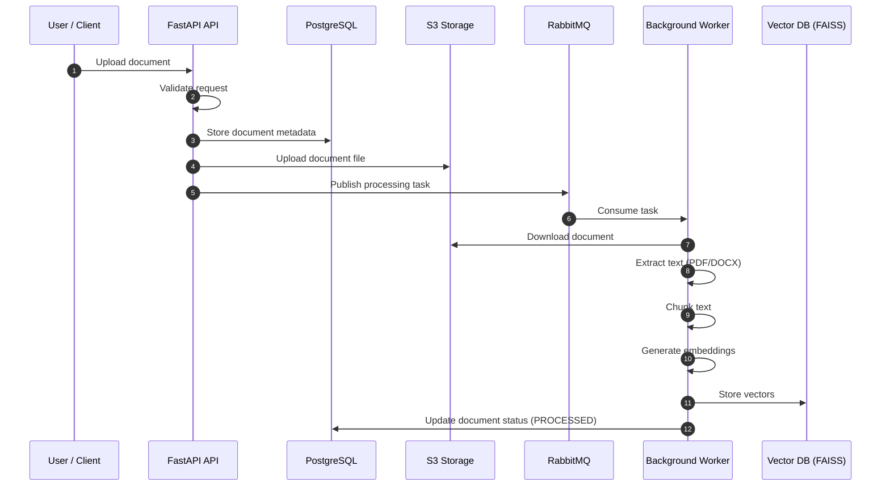
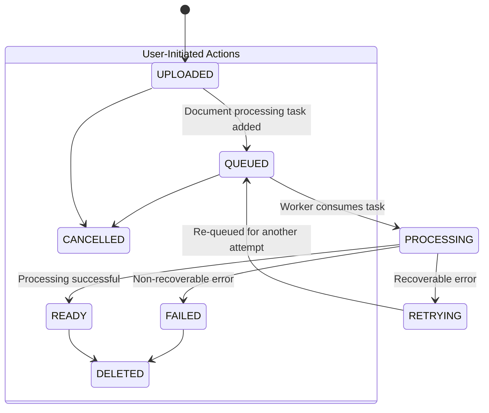

# 📄 DocQuery — RAG-Based Document Query Platform

DocQuery is an **end-to-end backend system** for **document ingestion, asynchronous processing, and Retrieval-Augmented Generation (RAG)**.  
It enables users to upload documents, generate embeddings, and query them using natural language in a scalable, production-inspired architecture.

This project is built as a **learning-focused yet real-world system**, emphasizing clean backend design, distributed processing, and modern AI-backed retrieval techniques.

---

## ✨ Problem Statement

Large Language Models (LLMs) cannot:
- Reliably process large documents
- Access private or user-uploaded data
- Guarantee factual answers without grounding

DocQuery solves this by:
- Chunking documents into smaller units
- Converting text into embeddings
- Retrieving only relevant chunks at query time
- Generating answers grounded in document context using RAG

---

## 🚀 Core Features

- 📥 Document upload with metadata tracking
- ⚙️ Asynchronous document processing using background workers
- ✂️ Text extraction and configurable chunking
- 🧠 Embedding generation pipeline
- 🔍 Semantic search using vector similarity
- 📨 Message-driven architecture using RabbitMQ
- ☁️ Cloud-ready storage using S3-compatible buckets
- 📊 Explicit document lifecycle management

---

## 🏗️ Clean Architecture Overview

            ┌──────────────┐
            │    Client    │
            │ (UI / API)   │
            └──────┬───────┘
                │ HTTP
                ▼
            ┌────────────────────────┐
            │     FastAPI API         │
            │────────────────────────│
            │ • Request validation   │
            │ • Metadata storage     │
            │ • Upload to S3         │
            │ • Publish task         │
            └──────┬─────────┬───────┘
                │         │
                │         └──────────┐
                ▼                    ▼
            ┌──────────────┐     ┌──────────────┐
            │ PostgreSQL   │     │   RabbitMQ   │
            │ (Metadata)  │     │ (Task Queue) │
            └──────────────┘     └──────┬───────┘
                                        │
                                        ▼
                                ┌──────────────────┐
                                │ Background Worker │
                                │──────────────────│
                                │ • Download file  │
                                │ • Extract text   │
                                │ • Chunk text     │
                                │ • Embed chunks   │
                                │ • Store vectors  │
                                └──────┬───────────┘
                                    │
                                    ▼
                                ┌──────────────┐
                                │  Vector DB   │
                                │ (FAISS etc.) │
                                └──────────────┘

### High-Level Flow
1. Client uploads a document
2. FastAPI API validates request and stores metadata
3. File is uploaded to object storage (S3)
4. Task is published to RabbitMQ
5. Background worker processes the document
6. Embeddings are stored in the vector database
7. User queries retrieve relevant chunks for RAG

---

## 🔁 Sequence Diagram — Document Ingestion & Processing



---


## 🧠 RAG Processing Flow

            User Query
                │
                ▼
            FastAPI API
                │
                ▼
            Vector Search (Top-K chunks)
                │
                ▼
            LLM (Context + Question)
                │
                ▼
            Final Answer

---

## 🛠️ Tech Stack

### Backend
- **Python 3.11**
- **FastAPI**
- **SQLAlchemy**
- **PostgreSQL**

### Async & Messaging
- **RabbitMQ**
- Dedicated background worker service

### Storage
- **AWS S3** (or any S3-compatible storage)

### Vector Search
- **FAISS** (pluggable for other vector databases)

### Infrastructure
- **Docker**
- **Docker Compose**

---

## 📁 Project Structure

```text
docquery/
├── api/
│   ├── app/
│   │   ├── core/         # Core components (settings, middleware)
│   │   ├── db/           # Database repositories and session
│   │   ├── models/       # SQLAlchemy ORM models
│   │   ├── routers/      # API endpoints (v1)
│   │   ├── services/     # Business logic
│   │   └── main.py       # FastAPI application entrypoint
│   ├── alembic/          # Database migrations
│   └── Dockerfile
│
├── worker/
│   ├── app/
│   │   ├── consumers/    # RabbitMQ message consumers
│   │   ├── processors/   # Text extraction, chunking, embedding
│   │   └── main.py       # Worker application entrypoint
│   └── Dockerfile
│
├── shared/
│   ├── config/           # Shared logging and settings
│   ├── embeddings/       # AI model and embedding utilities
│   ├── storage/          # Cloud storage clients
│   └── utils/            # Common utilities
│
├── data/                   # Sample data for testing
├── docker-compose.yml
└── README.md
```

---

## 🔄 Document Lifecycle

The lifecycle of a document is explicitly tracked through a series of statuses, providing clear observability into the ingestion and processing pipeline.



-   `UPLOADED`: The document has been successfully uploaded and a corresponding record is created. It is awaiting to be queued for processing.
-   `QUEUED`: A processing task for the document has been published to the message queue.
-   `PROCESSING`: A worker is actively processing the document (extracting text, chunking, and generating embeddings).
-   `READY`: The document has been fully processed and its vector embeddings are available for querying.
-   `FAILED`: Processing failed due to a non-recoverable error. Manual intervention may be required.
-   `RETRYING`: Processing failed with a recoverable error. The system will automatically re-queue the task for another attempt.
-   `PARTIAL`: The document was only partially processed due to errors with specific sections. Some content may be available for querying.
-   `CANCELLED`: A user or an automated process cancelled the processing task before completion.
-   `DELETED`: The document and all its associated data have been permanently deleted from the system.

---

## ⚙️ Local Development Setup

```bash
git clone https://github.com/Tanny1810/DocQuery.git docquery
cd docquery
docker-compose up --build
```

---

## ⚙️ Services Started

- FastAPI API  
- RabbitMQ  
- PostgreSQL  
- Background Worker  

---

## 🧩 Key Design Decisions

- Separate worker service to isolate heavy computation  
- Message queue-based processing for reliability and scalability  
- Chunk-based embeddings to handle large documents efficiently  
- Explicit status tracking for observability  
- Cloud-compatible architecture without vendor lock-in  

---

## 🎯 Learning Objectives

- Build a complete RAG system  
- Design scalable backend architectures  
- Work with message queues and workers  
- Understand vector databases and embeddings  
- Apply clean code and modular design principles  

---

## 🚧 Future Enhancements

- Authentication and authorization  
- API rate limiting  
- Multi-document querying  
- Streaming LLM responses  
- Support for multiple vector databases  
- Frontend UI  

---

## 📄 License

This project is intended for **educational and portfolio purposes**.

---

## 👤 Author

**Tanmay Chauhan**  
Backend Engineer | Python | Distributed Systems | RAG
